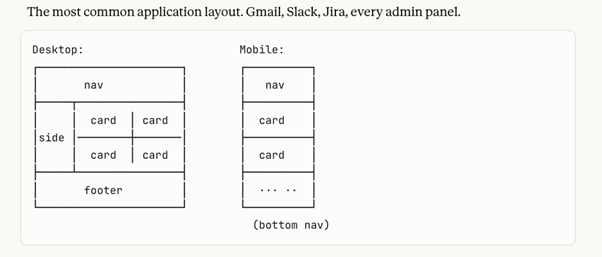
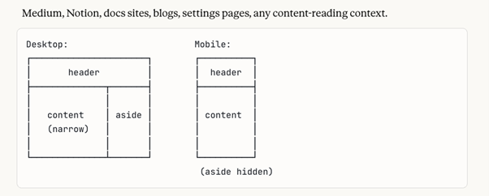
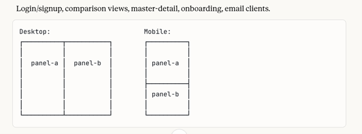
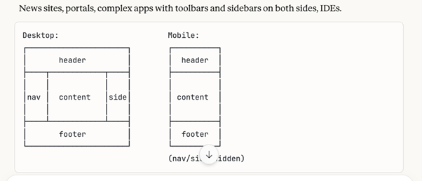
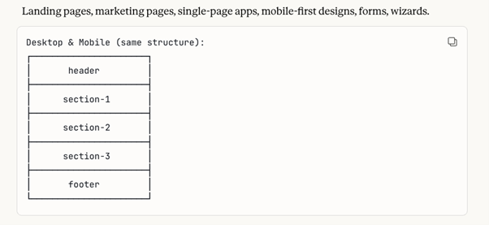

**ShoeString2**

*A Minimalist Web Framework in Object Pascal*

Nico — Second Edition, February 2026

**Chapters**

1. Origins
2. The Async Nature of the Web
3. Positioning
4. Styling and Theming
5. Typography
6. Layout
7. Forms and Validation
8. Building Components
9. Complex Components
10. Non-Visual Components
11. Node.js
12. ShoeString in Action
13. The Designer

# Chapter 1: Origins

## Design Goal

ShoeString-V1 began as a thin, typed layer over the browser — not a competitor to QTX or Smart Mobile Studio, which give Pascal developers a full component model with designers, property editors, and a runtime library that abstracts the browser entirely.

ShoeString had a different objective: expose browser APIs directly, without reimplementing, wrapping, or abstracting them. Every Pascal method maps one-to-one to a CSS property, DOM method, or browser API. If the browser provides it, ShoeString does not reimplement it.

## The Core

Five units. ~850 lines total.

**JElement.pas** — `TElement`, the base class for everything. A single variant field (`FHandle`) holds the DOM element. Manages child tracking, lazy click binding, CSS class manipulation, inline styles, stylesheet rules, and pseudo-class rules. ~350 lines.

**JForm.pas** — `TW3Form`. ~60 lines. Three virtual methods: `InitializeObject` (once, on first visit — create components here), `Show` (every `GoToForm` visit — refresh data-driven content), `Resize` (every window resize).

**JApplication.pas** — Form navigation. ~60 lines. Forms are singletons: `GoToForm` creates on first visit, reuses thereafter. Sets the active form visible, all others hidden.

**Globals.pas** — Browser externals, framework stylesheet, body defaults, element ID generation, utility functions. ~280 lines.

**Types.pas** — External class bindings for browser APIs used by the framework. ~100 lines.

## Minimal Application

```pascal
Unit Form1;
uses Globals, JForm, JPanel;

type
  TForm1 = class(TW3Form)
  protected
    procedure InitializeObject; override;
  end;

procedure TForm1.InitializeObject;
begin
  inherited;
  var Panel := JW3Panel.Create(Self);
  Panel.SetText('Hello from Shoestring');
end;
```

One Pascal file. One HTML file. One compiled JavaScript file. No build system, no package manager, no bundler.

## ShoeString-V2

Five years of use identified areas for improvement. ShoeString-V2 addresses:

- Simpler async readiness model
- A layout system (six pre-built patterns)
- Improved styling: CSS variables, dark mode, three styling mechanisms
- Improved typography
- Rewritten visual and non-visual components
- Positioning flexibility
- Container queries for component-level responsiveness

# Chapter 2: The Async Nature of the Web

## The Problem

`document.createElement` creates an element in memory. `appendChild` inserts it into the DOM. Layout — position, size, computed styles — is calculated asynchronously. Reading `offsetWidth` immediately after creation may return zero.

## Four Approaches

**1. MutationObserver** on the parent's `childList`. Used in the original Shoestring. Fires on DOM insertion. Must be set up before `appendChild`. Scales quadratically with sibling count.

**2. Promise.resolve() microtask.** Same timing as MutationObserver, simpler. Layout not guaranteed computed.

**3. WhenReady state machine.** Widget transitions through `creating → ready → destroying`. Properties set before `ready` are cached and flushed on transition. Architecturally complete; requires a state machine, property cache, and notification system. QTX implements this robustly.

**4. requestAnimationFrame.** Schedules a callback before the browser's next repaint. Browser computes styles and layout first. `offsetWidth` returns the real value.

## The Choice

ShoeString2 uses `requestAnimationFrame`. One line in the constructor:

```
window.requestAnimationFrame(ElementReady);
```

No observer setup. No destructor cleanup. No ordering dependency. No N² scaling. The callback fires once, after layout is computed. The tradeoff is a delay of up to 16ms — imperceptible for widget construction.

Assign `OnReady` only when computed dimensions are needed:

```pascal
Panel.OnReady := procedure(Sender: TObject)
begin
  console.log(Panel.Width); // reliable
end;
```

# Chapter 3: Positioning

## Preferred: Flexbox Column

The original Shoestring used absolute positioning (`SetBounds(left, top, width, height)`). Composite elements — a listbox positioning each item below its predecessor — required manual arithmetic. Layout changes for different viewports meant completely different code paths.

ShoeString2 does not default to anything. However the most used positioning is `display: flex; flex-direction: column`. Child elements stack vertically. No positioning arithmetic needed.

```pascal
var Header := JW3Panel.Create(Self);
Header.Height := 48;

var Content := JW3Panel.Create(Self);
Content.SetGrow(1); // fills remaining space

var Footer := JW3Panel.Create(Self);
Footer.Height := 24;
```

Header-content-footer layout, zero positioning logic. Resize-safe.

`Left`, `Top`, and `SetBounds` are removed from `TElement`. Absolute positioning is still available of course via `SetStyle`:

```pascal
Element.SetStyle('position', 'absolute');
Element.SetStyle('left', '100px');
```

## Horizontal and Grid

```pascal
SetStyle('flex-direction', 'row');  // horizontal flex
SetStyle('display', 'grid');        // two-dimensional grid
```

The framework provides typed access to CSS layout engines. It does not provide layout manager classes.

# Chapter 4: Styling and Theming

## Three Mechanisms

**`SetStyle`** — writes to `element.style` (inline). Highest specificity. Use for runtime-dynamic values.

**`SetRule`, `SetRulePseudo`, `SetRuleMedia`** — write rules to the framework stylesheet, targeting elements by unique ID. Use for pseudo-class states (`:hover`, `:focus`) and media queries.

**`AddClass`** — assigns a CSS class. Classes are defined via `AddStyleBlock`, which appends a `<style>` element to the document head. Supports all CSS constructs: `::before`, compound selectors, combinators, `@keyframes`, `@container`, `@font-face`.

**Convention used by framework components:** classes for shared appearance, `SetStyle` for per-instance or runtime state.

Using the framework typically only involves calling `SetStyle`. CSS class code lives inside components, written once by the component author.

## CSS Variables as Design Tokens

All design tokens are declared on `:root` in `ThemeStyles.pas`. Font-size scale lives in `TypographyStyles.pas`.

**Colours:** `--primary-color`, `--text-color`, `--bg-color`, `--surface-color`, `--border-color`, `--hover-color`. Semantic: `--color-success/warning/danger/info`, each with a `-bg` variant.

**Spacing:** `--space-1` (4px) through `--space-16` (64px).

**Border radius:** `--radius-sm` through `--radius-full`.

**Elevation:** `--shadow-sm` through `--shadow-xl` (cards, dropdowns, modals).

**Animation:** `--anim-duration` — change once, every transition adjusts.

**Field tokens:** `--field-height`, `--field-padding`, `--field-border`, `--field-radius`, `--field-bg`, `--field-focus-border`, `--field-focus-ring`.

## Dark Mode

```css
:root       { --bg-color: #f8fafc; --text-color: #334155; }
:root.dark  { --bg-color: #0f172a; --text-color: #e2e8f0; }
```

Toggle with one line of JavaScript. Every component updates instantly. No event bus, no theme manager.

## Interaction States

A shared `.interactive` class provides hover, focus-visible, active, and disabled states. Any clickable component calls `AddClass('interactive')`.

# Chapter 5: Typography

## Fluid Base Size

```css
:root { font-size: clamp(15px, 1vw + 12px, 18px); }
```

Scales from ~15.75px at 375px viewport to ~17px at 1440px. No media queries. One declaration; all `rem` values scale proportionally.

## Type Scale

CSS variables from `--font-size-xs` (0.75rem) to `--font-size-4xl` (2.25rem). Utility classes apply them:

```pascal
Title.AddClass('text-3xl');
Title.AddClass('font-bold');
Body.AddClass('text-prose');
```

**`text-prose`** — caps line length at 65ch, sets relaxed line height, enables word wrapping and hyphenation.

**`text-mono`** — monospace font at 0.9em, visually consistent with surrounding text.

# Chapter 6: Layout

## Six Pre-Built Layouts

Any browser layout feature is directly accessible. ShoeString-V2 also provides six pre-built patterns, all mobile-responsive:

1. **Dashboard** — sidebar, header, auto-filling card grid. Collapses to single column on mobile.


2. **Document** — fixed header, centered content column with max-width, optional sidebar.


3. **Split** — two equal or weighted panels, horizontal or vertical.


4. **Holy Grail** — header, footer, three columns.


5. **Stacked** — header, vertical sections, footer.


6. **Kanban** — header plus horizontal-scrolling columns. Uses `overflow-x: auto` on the shell and `overflow-y: auto` per column.

Each layout is tunable via CSS variables. Override on an element for that instance; override on `:root` for all.

Example using the document layout:

```pascal
unit FormArticle;
interface
uses JElement, JForm, JPanel, LayoutDocument;

type
  TFormArticle = class(TW3Form)
  private
    Shell, Header, Body, Content, Aside: JW3Panel;
  protected
    procedure InitializeObject; override;
  end;

implementation
uses Globals, JButton, JLabel, TypographyStyles;

procedure TFormArticle.InitializeObject;
begin
  inherited;
  Shell   := JW3Panel.Create(Self);   Shell.AddClass(csDocShell);
  Header  := JW3Panel.Create(Shell);  Header.AddClass(csDocHeader);
  Body    := JW3Panel.Create(Shell);  Body.AddClass(csDocBody);
  Content := JW3Panel.Create(Body);   Content.AddClass(csDocContent);
  Aside   := JW3Panel.Create(Body);   Aside.AddClass(csDocAside);
  // ... populate header, content, aside
end;
end.
```

## Responsive Strategy

`TElement` has no window resize listener. Responsiveness is handled entirely in CSS: media queries restructure grid layouts, flex containers wrap, container queries adapt components to their parent width. No JavaScript resize events.

## Container Queries

The parent declares `container-type: inline-size`. The child uses CSS Grid with a single-column default. A `@container` rule switches to multi-column when the container is wide enough — one CSS property change restructures the layout.

```pascal
Parent.AddClass('card-container'); // declares container context
```

Container queries are appropriate for components with genuine layout restructuring — cards, dashboard panels, product listings. Use flex for components that simply stack or flow.

# Chapter 7: Forms and Validation

## Field Base Class

A shared `.field` CSS class in `ThemeStyles` defines height, padding, border, radius, font size, transition, focus ring, invalid state, and disabled state. Every form component calls `AddClass('field')`. Change `--field-height` on `:root` and every field adjusts.

## Values

Form components read from and write to the DOM element directly. No backing field, no cache. The browser is the single source of truth.

## Validation

`Validators.pas` provides pure functions: `IsRequired`, `IsEmail`, `IsNumeric`, `IsInteger`, `IsURL`, `MinLength`, `MaxLength`, `ExactLength`, `InRange`, `Matches`. No DOM dependency. Compiles to both browser and Node.js.

```pascal
if not IsRequired(FEmail.Value) then
  FEmail.AddClass('invalid')
else
  FEmail.RemoveClass('invalid');
```

The class triggers CSS styling. The function provides logic. The component provides the value.

## Declarative Forms with TFormulator

For routine forms — collect, validate, submit — hand-building the DOM tree is overkill. `TFormulator` (`helpers/JFormulator.pas`) takes a JSON config and emits the same widgets you would write by hand:

```pascal
TFormulator.BuildFromJSON(Host, Config,
  procedure(Values: variant)
  begin
    HandleSubmit(Values);
  end);
```

Config is a tree of field descriptors:

```json
{
  "title":  "Contact us",
  "submit": { "label": "Send", "variant": "primary" },
  "fields": [
    { "row": [
      { "name": "first", "type": "text", "label": "First name", "required": true },
      { "name": "last",  "type": "text", "label": "Last name" }
    ] },
    { "name": "email", "type": "email", "label": "Email", "required": true },
    { "name": "topic", "type": "select", "default": "question",
      "options": [
        { "value": "question", "label": "Question" },
        { "value": "bug",      "label": "Bug report" }
      ] },
    { "name": "message", "type": "textarea", "rows": 4, "required": true,
      "defaultFrom": { "switch": "topic", "cases": {
        "question": "I have a question about...",
        "bug":      "I found a bug. Steps to reproduce:"
      } } }
  ]
}
```

**Field types:** `text` | `email` | `password` | `number` | `textarea` | `select`.

**Layout:** one primitive — wrap a sub-array in `{ row: [...] }` to lay its fields out in a two-column grid. Anything beyond that, hand-build.

**Validation:** `required: true` plus an optional `requiredMessage`. Errors render inline under each offending field on submit; the callback fires only when the form is clean.

**Dynamic defaults:** `defaultFrom: { switch, cases }`. The source field's value picks a case; the case's text is written into the target field unless the user has already typed into it (per-DOM dirty bit).

**Reuses framework primitives.** Emits the same `JW3Input` / `JW3Select` / `JW3TextArea` / `JW3Button` widgets with the same `field-group` / `field-label` / `field-error` classes from `ThemeStyles`. No new theme, no parallel widget tree, no parser dependency beyond `JSON.parse`.

**When not to use it.** Bespoke screens — animations, custom geometry, anything the schema can't express without growing keywords — stay imperative. Rule of thumb: *if the screen mostly collects values and submits them, declare it; if it mostly displays, animates, or reacts, build it.*

A live example is in the **Form-ulator** entry of the Non-Visual Components gallery — it renders a contact form from JSON, dumps the collected values on submit, and prints the source schema next to the rendered output.

# Chapter 8: Building Components

## The Pattern

**Style unit** — registers CSS classes via `AddStyleBlock` in its `initialization` section. A guard flag prevents double-registration.

**Pascal class** — inherits from `TElement`. Constructor creates the HTML element, adds the CSS class, wires events.

**String constants** for class names — compile-time safety. A typo in `csTabsBtn` fails at compile time; a typo in `'tabs-btn'` fails silently at runtime.

Rule: if the constructor exceeds ~10 lines, CSS work has probably leaked into Pascal.

## Click Handling

`OnClick` uses lazy binding — the DOM listener is attached only when `OnClick` is first assigned. 200 panels with 5 buttons gets 5 listeners, not 200. `CBClick` does not call `stopPropagation`; events bubble normally. Components that need isolation (modals, backdrops) call it explicitly.

## Child Lifecycle

`TElement` tracks children in an internal array. The destructor iterates children backwards, freeing each, then unregisters from the parent, then removes from the DOM. `Clear` frees all children. No orphaned Pascal objects.

## Classless Components

All styling methods work without CSS classes. Using only `SetStyle` and `SetRulePseudo` is valid — CSS variables still resolve, pseudo-classes work. The cost: N instances emit N per-element pseudo-class rules instead of sharing shared class rules. Irrelevant for a handful of toolbars; relevant for a datagrid rendering 10,000 cells.

# Chapter 9: Complex Components

## Tree View

`JTreeView` renders hierarchical data with expand/collapse, keyboard navigation, lazy loading, and ARIA roles.

```pascal
Tree := JW3TreeView.Create(Panel);
var Root := Tree.AddNode(nil, 'Documents');
var Work := Tree.AddNode(Root, 'Work');
Tree.AddNode(Work, 'Report.docx');
```

Each node owns a row (toggle + label) and a children container. Indentation: `calc(depth * var(--tree-indent, 20px) + 8px)`. Toggle is a Unicode triangle rotated 90° via CSS transform. Children hidden via `display: none` class.

**Lazy loading** — set `Node.IsLazy := true`, assign `Node.OnExpand`. Callback fires once on first expand; add children dynamically, then set `IsLazy := false`.

**Keyboard navigation** — Up/Down moves between visible nodes. Right expands or moves to first child. Left collapses or moves to parent. Focus tracked as an index into a flat list of currently visible nodes, recalculated on each expand/collapse.

**Accessibility** — `role="tree"` on the widget, `role="treeitem"` with `aria-expanded` per node, `role="group"` on child containers.

## Data Grid

`JDataGrid` handles 100,000+ rows through virtual scrolling, with column resize, inline editing, keyboard navigation, sorting, and clipboard copy.

```pascal
Grid := JW3DataGrid.Create(Panel);
Grid.AddColumn('name',  'Name',  200, 'left', true, true);
Grid.AddColumn('email', 'Email', 280, 'left', true, true);
Grid.AddColumn('role',  'Role',  120);
Grid.SetData(LargeArray);
```

**Virtual scrolling** — a sentinel `<div>` sets scroll height to `rowCount × rowHeight`. Only visible rows plus a buffer (default ±10) are rendered. The table translates via `transform` to align with scroll position. 100,000 rows at 40px = a 4,000,000px sentinel; ~50 DOM elements at any time.

**Sorting** — click header for ascending, again for descending, third click restores original order. `FData` (original) is never mutated; `FView` holds reordered indices. Uses native `Array.sort` with `localeCompare` for strings. Nulls sort to end.

**Column resize** — 5px resize handle at each header's right edge. `mousemove`/`mouseup` listeners attach to `document` on drag start. Minimum 50px per column. Header and body `<colgroup>` update in real time.

**Inline editing** — double-click or Enter/F2 on an editable column. Cell text replaced by `<input>`. Enter commits, Escape cancels, Tab advances to next editable cell. `OnCellEdit` fires with old and new values.

**Cell focus and clipboard** — arrow keys navigate cells; Tab wraps at row boundaries. Ctrl+C (Cmd+C) copies focused cell via `navigator.clipboard`.

The grid follows framework principles throughout: CSS variables for all visual properties, ARIA roles, native scrollbar and `transform` for scrolling (no custom scrollbar), `<colgroup>` for column widths.

If a light-weight data table is the better solution, use `JW3Table`. The kitchen-sink app contains a worked example of this component. Columns are declared once; `SetRows` replaces the table body from a row array (for example, a database result).

## Chat Panel

`JW3ChatPanel` is a bubble-style message list with a typing indicator and click-to-copy on each bubble. ~270 lines including styles.

```pascal
Chat := JW3ChatPanel.Create(Panel);
Chat.AppendUser('Hello');
Chat.AppendAssistant('Hi — what can I help with?');
Chat.ShowTyping;       // animated three-dot indicator
Chat.HideTyping;
```

**Bubble layout** — each message is a flex row (right-justified for user, left for assistant) with a styled bubble at `max-width: 75%` and asymmetric border-radius for the tail-on-corner shape. Auto-scrolls to the bottom on every append.

**Typing indicator** — single lazily-created row, three dots animated via staggered `animation-delay`. Toggled by `display`, not destroyed and recreated — avoids touching the parent's child list mid-life. Re-appended to the end on every new message so it stays beneath the latest bubble.

**Click to copy** — clicking a bubble writes its raw text (not the rendered HTML) to `navigator.clipboard`, then flashes a "copied" hint for ~900ms via a CSS class toggle.

**Light markdown only** — `**bold**` and `\n`. HTML entities escaped first; ~5 lines of regex. Code blocks, syntax highlighting, full markdown, link previews — those are the consuming app's problem. Apps that need them call `SetHTML` on the bubble's DOM node after their own parser.

Reuses framework tokens — `--surface-color`, `--surface-3`, `--primary-color`, `--radius-lg`, `--text-light` — so dark mode and theme changes land automatically.

# Chapter 10: Non-Visual Components

Non-visual components are plain Pascal classes inheriting from `TObject`. No DOM elements.

**Five categories:**

- **Services** — long-lived, often global. Database connections, auth managers.
- **Async operations** — short-lived. HTTP requests, file reads. Often just a procedure with callbacks.
- **Models** — data containers with fields and validation.
- **Adapters** — bridges between visual and non-visual. Connects a data array to a list component.
- **Stores** — observable state. `DataStore` is a key-value store; UI components subscribe to keys and update on change. `BeginUpdate`/`EndUpdate` batches notifications.

A live gallery of every category below sits in the **Non-Visual Components** entry of the kitchen-sink app.

## Services

Long-lived objects created once and used across the application. Hold state, own resources, expose a typed API. Inherit from `TObject` and never touch the DOM.

```pascal
type
  TSessionService = class
  public
    procedure Login(const UserName: String);
    procedure Logout;
    function  IsLoggedIn: Boolean;
    function  UserName: String;
    function  Role: String;
  end;

// In a form's InitializeObject:
FSession := TSessionService.Create;

// Anywhere afterwards:
FSession.Login('Nico');
if FSession.IsLoggedIn then ...
```

Lifetime tracks the form that owns it. Survives navigation, freed in the form's destructor. The framework imposes no service container or dependency-injection layer — Pascal scope and ownership are sufficient.

## HTTP Helper

```pascal
FetchJSON('https://api.example.com/data',
  procedure(Data: variant) begin
    // handle response
  end,
  procedure(Status: Integer; Msg: String) begin
    // handle error
  end
);
```

Wraps `XMLHttpRequest`, parses JSON, routes to callbacks. 

It contains PostJSON :

```pascal
// POST — JSON body
PostJSON(URL, '{"name":"Tim"}', OnSuccess, OnError);

// POST — form-encoded body (application/x-www-form-urlencoded)
PostForm(URL, 'action=books_all&id=42', OnSuccess, OnError);
```

`PostJSON` is appropriate for REST APIs that expect a JSON request body.

## Validators

Pure functions in `Validators.pas`. Take a string, return a boolean. No DOM dependency, no side effects. Compile to both browser and Node.

`IsRequired` · `IsEmail` · `IsURL` · `IsInteger` · `IsNumeric` · `MinLength(s, n)` · `MaxLength(s, n)` · `ExactLength(s, n)` · `InRange(s, lo, hi)` · `Matches(s, regex)`

```pascal
if IsEmail(Email.Value)
  then Email.AddClass('valid')
  else Email.AddClass('invalid');
```

The class triggers CSS styling. The function provides logic. The component provides the value. Three responsibilities, three places. Form-ulator (Chapter 7) wires `required` declaratively for the common case; reach for the validators directly when you need anything more.

## Models

Plain Pascal records or classes that hold typed data. Optionally carry validation. No DOM dependency, no framework coupling — they move unchanged to a Node.js backend.

```pascal
type TOrder = record
  OrderID:   String;
  Customer:  String;
  Amount:    Float;
  Lines:     Integer;
  Completed: Boolean;
end;

// Validation lives next to the data, not in a separate "model" base class.
var Valid := (O.Customer <> '') and (O.Amount > 0) and (O.Lines > 0);
```

Records over classes when there is no behaviour. Classes when methods or inheritance are needed. The framework never imposes a base class on your domain types.

## DataStore

`JW3DataStore` is an observable key-value store. Components subscribe to keys and receive a callback whenever the value changes. Decouples data producers from consumers — the producer never knows who's listening.

```pascal
var Store := JW3DataStore.Create;

// Subscribe — returns a sub-ID for later Unsubscribe.
var SubId := Store.Subscribe('user.name',
  procedure(const Key: String; Value: variant)
  begin
    NameLabel.SetText(Value);
  end);

// Put fires every subscriber on that key.
Store.Put('user.name', 'Nico');

// Wildcard — fires on every change, useful for logging.
Store.Subscribe('*', LogChange);

// Observe — subscribe AND immediately fire with the current value.
Store.Observe('cart.count', UpdateBadge);

// Batched updates — defer notifications until EndUpdate.
Store.BeginUpdate;
Store.Put('x', 1); Store.Put('y', 2); Store.Put('x', 3);
Store.EndUpdate;  // fires once per changed key, not once per Put
```

Convention: dot-notation keys (`cart.count`, `user.name`) — string-typed, not enforced. Values are `variant`, anything JS can hold. Multiple writes to the same key inside `BeginUpdate`/`EndUpdate` collapse into a single notification with the final value.

The pattern scales beyond UI — agent-orchestration code uses the same store as a pub/sub bus (`FBus.Put('msg:' + MsgId, AMsg)`), with the dashboard subscribing to render events. One primitive, two domains.

## Adapters

Bridges between non-visual data and visual components. The data side knows nothing about the DOM; the visual side knows nothing about the array's shape. The adapter is the only place that sees both.

```pascal
type
  TContactAdapter = class
  private
    FData:    array of TContact;
    FListBox: JW3ListBox;
  public
    constructor Create(ListBox: JW3ListBox);
    procedure   SetData(Data: array of TContact);
    function    ItemAt(Index: Integer): TContact;
  end;

// One direction: array → list.
var A := TContactAdapter.Create(MyListBox);
A.SetData(Contacts);

// Other direction: selection → record.
MyListBox.OnSelect := procedure(Sender: TObject; Value: String)
begin
  ShowDetails(A.ItemAt(StrToInt(Value)));
end;
```

If you find an adapter starting to grow into a small framework, that's the signal to step back — most adapters are 30–50 lines and doing more is usually a sign you've conflated the bridge with the data model behind it.

## Database Connectivity

The configuration of back-end servers is varied to say the least, a framework like this can provide some abstractions but can't cover all server configurations and data providers.

What is included is an example node.js server to a MySQL database, which covers a broad range of solutions.
Also included are pHp functions to accommodate connection to SQL based server side databases. The reason to include pHp is that it eliminates the hassle of starting / stopping external node servers, pHp does this automatically.

The example/db-connect directory contains some examples.
See a [live demo](https://lynkfs.com/dev-servers/books-prepared/) here.


Non-visual components are created and freed by the developer. No automatic ownership.

# Chapter 11: Node.js

## Same Compiler, Different Runtime

No DOM, no CSS, no `document`, no `window`. The browser core does not exist in a Node target. What exists: everything Node provides natively — HTTP, file system, OS, streams, timers — accessible via `require`.

## NodeTypes.pas

```pascal
var Console external 'console': JConsole;
var JSON    external 'JSON':    TJSON;
var Global  external 'global':  variant;

function ReqNodeModule(id: string): variant; external 'require';
```

`ReqNodeModule` maps to `require` (renamed because `require` is reserved in DWScript). Everything else is plain Pascal. The unit will be extended with additional externals as needed.

## Entrypoint

```pascal
uses NodeHttpServer;
```

The `initialization` section of the named unit runs at startup. No `Application`, no `CreateForm`, no `GoToForm`.

## HTTP Server

```pascal
unit NodeHttpServer;
interface
uses NodeTypes;
implementation

initialization
  var http := ReqNodeModule('http');
  var url  := ReqNodeModule('url');

  http.createServer(
    procedure(req, res: variant)
    var parsed: variant; pathname, body: String; code: Integer;
    begin
      parsed   := url.parse(String(req.url), true);
      pathname := String(parsed.pathname);
      code     := 200;

      if pathname = '/' then begin
        var obj: variant := new JObject;
        obj.status  := 'ok';
        obj.message := 'Hello from Object Pascal on Node';
        body := JSON.Stringify(obj);
      end else begin
        code := 404;
        asm @body = JSON.stringify({ error: 'not found' }); end;
      end;

      asm res.writeHead(@code, { 'Content-Type': 'application/json' }); end;
      res.end(body);
      console.log(String(req.method) + ' ' + pathname + ' → ' + IntToStr(code));
    end

  ).listen(3000, procedure() begin
    console.log('Listening on port 3000');
  end);
end.
```

The request handler is an anonymous procedure — the same pattern as `OnClick` and `OnReady` in the browser target.

## Inline Assembly

Use `asm` blocks when Pascal syntax doesn't reach a JavaScript idiom:

```pascal
asm
  @body = JSON.stringify({ utc: new Date().toUTCString(), epoch: Date.now() });
end;
```

## Shared Units

Any unit with no dependency on `JElement`, `Globals`, `document`, or `window` compiles to both targets unchanged. `Validators.pas` is an example — pure string functions, no DOM.

## Project Structure

```
app.entrypoint.pas               ← uses YourServerUnit
node/nodeCore/NodeTypes.pas      ← externals
node/YourServerUnit.pas          ← implementation
helpers/Validators.pas           ← target-agnostic units
```

# Chapter 12: ShoeString in Action

Live demos at [lynkfs.com/docs/ss-v2](https://lynkfs.com/docs/ss-v2):

- **Visual components** — kitchen sink application
- **Page layouts** — all six layouts in the layout tab
- **Non-visual components** — nonvisual tab
- **Additional example** — invoiceApp tab

# Chapter 13: The Designer

Although there is a stand-alone web-based designer app available, with the ability to generate Shoestring-V2 compatible forms, it is not included in this framework.

Design in this day and age is not so much about form-design but more about app design. There is a separate framework EDAM-V2 which channels a high-level specification through a number of defined steps and turns it into a complete working app. 

See the [EDAM2 design spec](https://lynkfs.com/docs/Edam2) for details.
As an example see the live [Edam2 demo](https://lynkfs.com/docs/Edam2/HAS). The generated form-code is available in examples/homeAssist.

